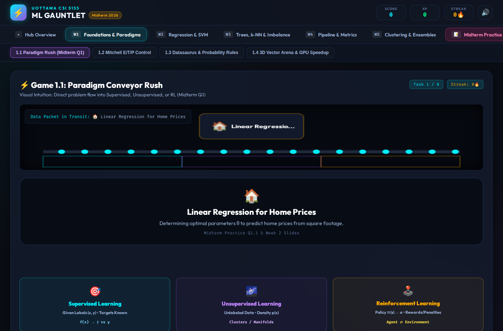
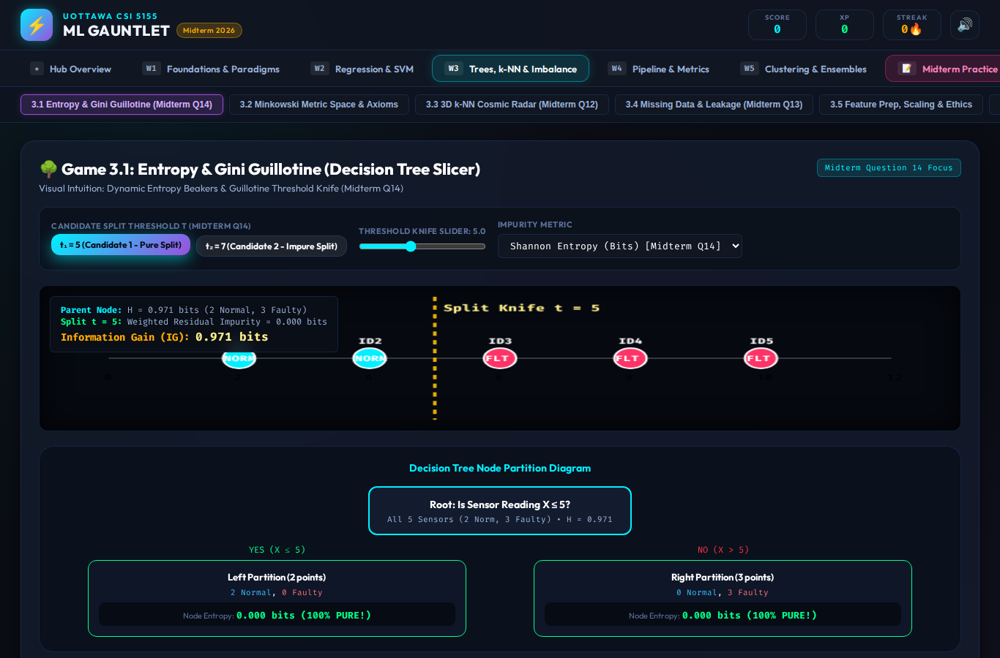
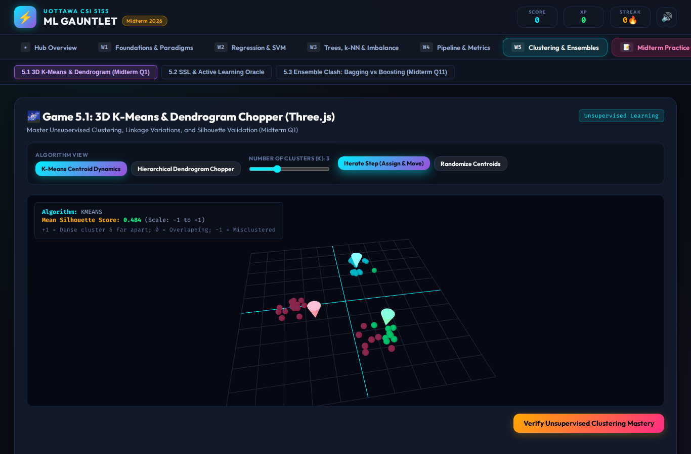
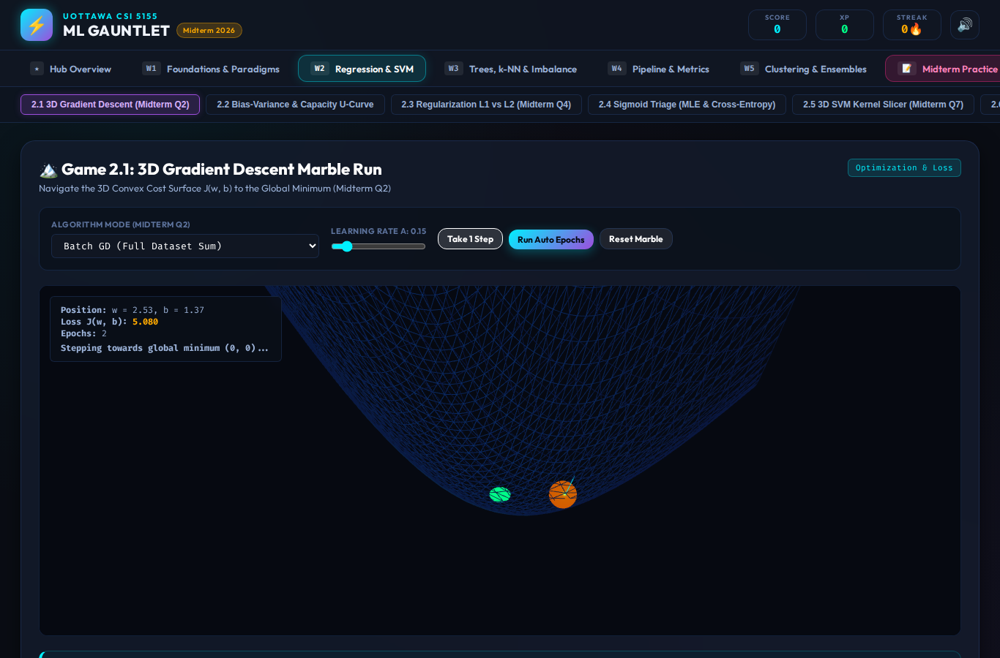

# CSI 5155: Machine Learning — The Gauntlet

An interactive study game for learning and reviewing machine-learning concepts from CSI 5155. Instead of presenting the course as a sequence of static notes, The Gauntlet turns core ideas into small visual experiments, simulations, and challenges that learners can explore at their own pace.

## Screenshots

These examples show interactive lessons and visualizations—not quiz or exam screens.

<table>
  <tr>
    <td align="center">
      
      <br><strong>Learning paradigms</strong><br>Sort data and tasks into supervised, unsupervised, and reinforcement learning.
    </td>
    <td align="center">
      
      <br><strong>Decision-tree splitting</strong><br>Explore candidate thresholds and see how impurity and information gain change.
    </td>
  </tr>
  <tr>
    <td align="center">
      
      <br><strong>3D K-means clustering</strong><br>Move centroids and observe cluster assignments in a Three.js visualization.
    </td>
    <td align="center">
      
      <br><strong>Gradient descent</strong><br>Step through optimization on a 3D loss surface and see parameters move toward a minimum.
    </td>
  </tr>
</table>

## What you can explore

- **Five weeks of course material:** foundations and learning paradigms; regression, optimization, and SVMs; decision trees, k-NN, and data preparation; evaluation, pipelines, feature selection, and PCA; clustering, semi-supervised learning, and ensembles.
- **Interactive visual lessons:** manipulate thresholds, parameters, points, centroids, and other controls to see how a method behaves.
- **Visual and 3D simulations:** explore concepts such as gradient descent, clustering, vector geometry, and decision boundaries.
- **Before-and-after weekly flashcards:** complete a week’s flashcard deck before its lessons, then repeat it after marking every lesson task complete. The 64 weekly cards come from `public/flashcards.md`; progress and card ratings are saved in the browser.
- **Math typesetting:** flashcard equations are rendered with KaTeX, including inline and display math.
- **Progress and preferences:** retain study progress locally and switch between light and dark themes.
- **Midterm practice:** an optional 14-question practice exam with scoring and worked explanations.

## Run locally

Install dependencies and start the Bun development server:

```bash
bun install
bun run start
```

Open [http://localhost:3000](http://localhost:3000). The server serves the app and builds the browser bundle when requested.

## Development commands

```bash
bun run build       # Build src/main.ts into public/bundle.js
bun run test:e2e    # Run the Playwright end-to-end suite
```

The end-to-end tests use Playwright. If its bundled Chromium is unavailable in your environment, set `PLAYWRIGHT_CHROMIUM_EXECUTABLE_PATH` to an installed Chromium executable before running the tests.

## Built with

- **Bun** for the runtime, package management, and development server
- **TypeScript** for application and game logic
- **Three.js** for interactive 3D scenes
- **KaTeX** for mathematical notation in flashcards
- **Playwright** for browser-based end-to-end testing

## Project layout

```text
public/
  flashcards.md   # Source deck used by the weekly flashcard rounds
  index.html      # App shell
  style.css       # App styling and themes
src/
  games/          # Interactive weekly lessons
  quiz/           # Midterm practice exam
  flashcards.ts   # Deck parsing, rendering, and study flow
  main.ts         # App startup and navigation
  state.ts        # Persisted learner progress
tests/
  e2e.test.ts     # End-to-end tests
screenshots/      # App screenshots used in this README
```
